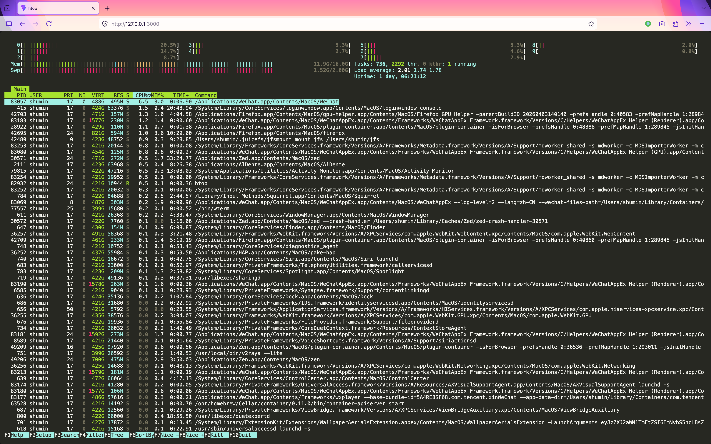
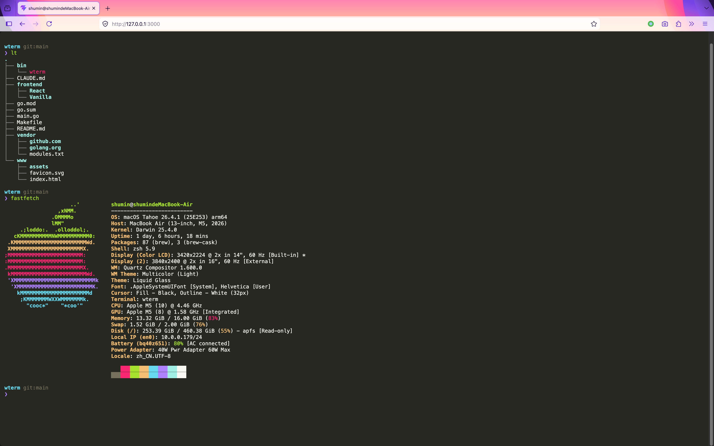

# wterm

A Web Terminal Based on wterm(https://github.com/vercel-labs/wterm)

## 功能描述

基于 WebSocket + wterm 的 Web 终端，在浏览器中提供完整的交互式 Shell 体验，支持终端尺寸自适应以及主题。

---





## 技术栈

### 前端

| 库     | 用途              |
| ------ | ----------------- |
| React  | UI 框架           |
| Vite   | 构建工具          |
| @wterm | 基于WASM的WEB终端 |

### 后端

| 库                           | 用途                                       |
| ---------------------------- | ------------------------------------------ |
| gofiber/fiber/v3             | HTTP 服务器，提供静态文件和 WebSocket 路由 |
| gofiber/contrib/v3/websocket | WebSocket 升级与处理                       |
| creack/pty                   | 创建 PTY，驱动 Shell 进程                  |

## 开发与构建

```bash
make build
./bin/wterm
```

访问 `http://localhost:3000`
